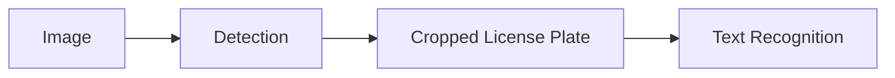
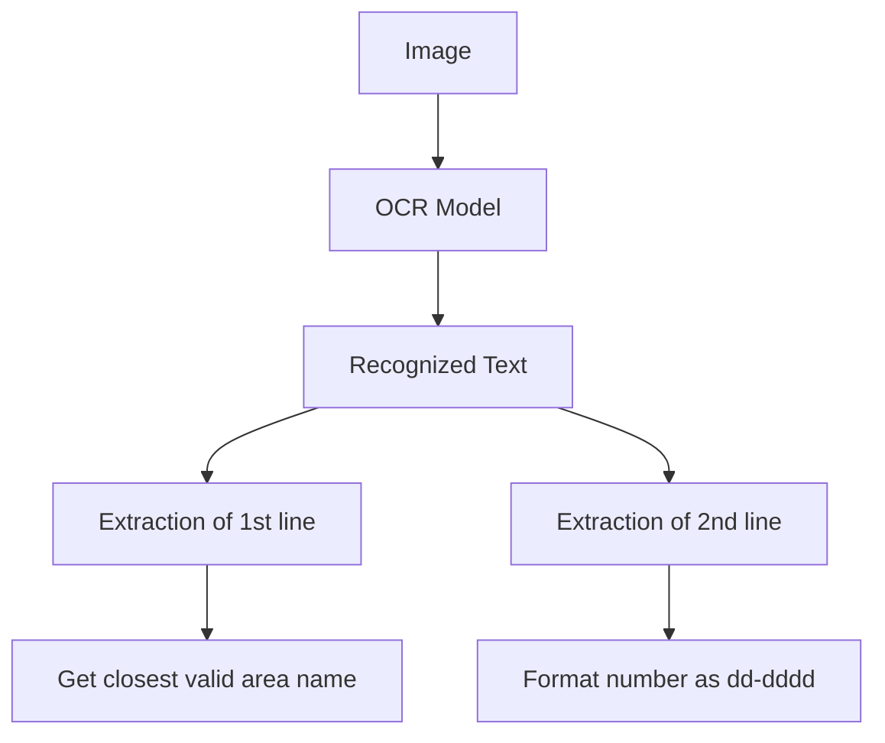
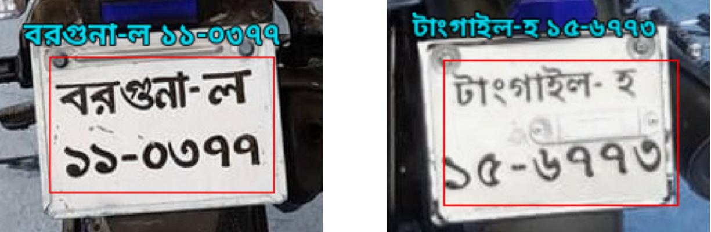
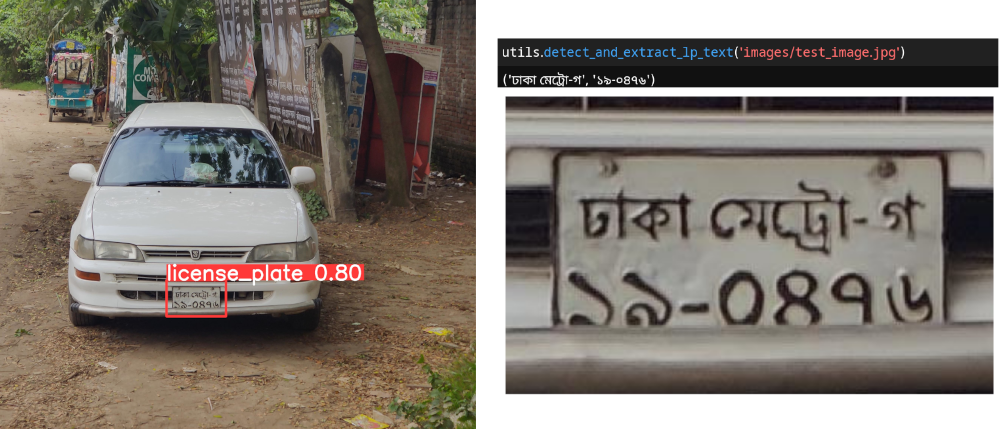

## Introduction

This project is dedicated to developing a robust pipeline for license plate recognition (LPR) in Bangladesh. The LPR process involves two crucial steps: first, detecting the region of an image where the license plate is located, and second, performing Optical Character Recognition (OCR) to extract the text. The pipeline can be summarized as follows:



### Detection

yolov8 is used for detection of the license plate. yolo can already detect license plates but it can be fine tuned on a particular dataset as well. `models/yolo.pt` is the model fine tuned on some images of vehicles containing bangla license plates.

### Recognition

[EasyOCR](https://github.com/JaidedAI/EasyOCR) library is used for the text recognition part. They already have a model for recognizing bengali characters. The model used by EasyOCR can also be fine tuned using this [repository](https://github.com/clovaai/deep-text-recognition-benchmark). The model in `models/EasyOCR/models` is the fine tuned version of the pretrained bengali model on a custom dataset.

## Text Extraction

License plates found in vehicles in bangladesh has two lines in it. The first line contains the area name and the vehicle class and the second lines contains a 6 digit number in the format `dd-dddd`. The number of possible area names are finite, so a list of all possible area names is used to correct minor mistakes made by the ocr model. This is done by using pythons difflib library which has the `get_close_matches` method. This method returns the string in the list that is the closest to the input string.



<figure>

<figcaption>Example of character recognition from cropped license plate</figcaption>
</figure>

## Usage

Convenient utility functions are provided to execute the full pipeline of detection and recognition.

For this to work, you need to have all the dependencies installed.

First create a virtual environment.

```sh
python -m venv ./
```

Activate the virtual environment

```sh
./Scripts/activate
```

Then install the dependencies.

```sh
pip install -r necessary-requirements-to-run.txt
```

Download and extract the model files

```sh
gdown 1ujSYC3tEC3VNoxqUIWO2PG7Lg5HAdYqn
unzip models.zip
```

For windows
```sh
tar -xf models.zip
```


Now test with the demo image.

```python
import utils
utils.detect_and_extract_lp_text('images/test_image.jpg')
```

<figure>

<figcaption>Example of using the full pipeline</figcaption>
</figure>

The code was tested with Python 3.11.5.

## Real Time License Plate Recognition

This a work in progress. There are some issues with using compatible font for bengali. This output was obtained from running yolo detection in google colab and modifying the annotation portion of the detection code.

